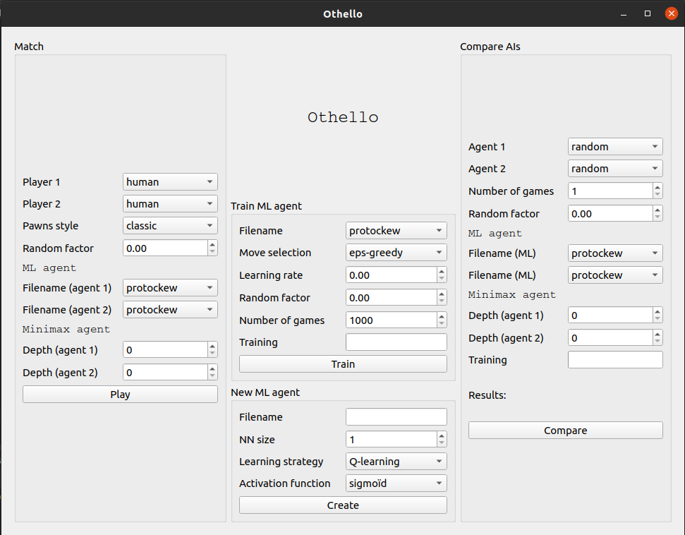
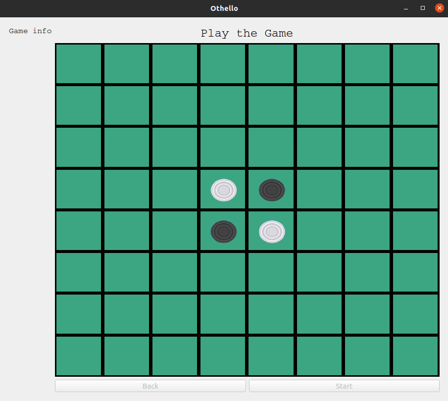

# Othello

Vous trouverez ci-dessous les instructions et détails sur le jeu Othello. Le but du jeu étant d'avoir le plus de jetons de sa couleur à la fin de la partie. Chaque joueur pose un jeton de sa propre couleur à son tour, et retourne tous les jetons de l'adversaire qu'il vient de prendre en tenaille.

Le jeu est présenté ici avec deux techniques d’IA, un Machine Learning et une recherche avec l’algorithme minimax.

## Installation et lancement
Pour installer le jeu, déplacez-vous dans le répertoire du programme.

Après avoir installé python et poetry, rendez vous dans ce dossier et installez les dépendances du projet:

```
poetry install
```

Ensuite, pour lancer le jeu :
```
poetry run python main.py
```
Le jeu s'ouvrira alors dans une fenêtre


## Utilisation

Depuis la fenêtre du menu, vous avez plusieurs possibilités :
- Match : jouer ou afficher une partie, opposant deux joueurs. Chacun des deux joueurs peut être humain, ML, Minimax ou random. Dans le cas d'un agent IA, les paramètres peuvent être choisis.
En cliquant sur "Play", une fenêtre de jeu s'affiche. Il suffit alors de cliquer sur Start pour démarrer une partie.
- New ML agent : créer un nouvel agent de Machine Learning en indiquant le nombre de neurones. Cela va créer un nouveau réseau de neurones et l'enregistrer.
- Train ML agent : entrainer un agent ML, en choisissant le nombre de parties d'entrainement et les paramètres.
- Compare AIs : comparer deux agents (random, minimax, ou un des ML créé auparavant).

